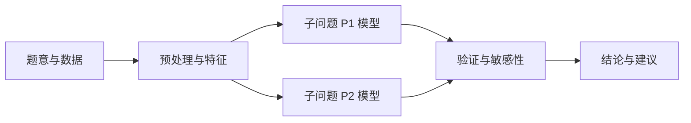

# [论文题目：对象 + 任务 + 方法亮点]

> 使用前先完成 `competition-profile.md`。本模板借鉴长三角高校数学建模竞赛公开 LaTeX 模板的章节逻辑重新编写；它是写作骨架而非赛事官方文件，具体格式、页数、匿名和提交要求一律以当届官方规则为准。

## 摘要

**任务：** 用 1–2 句交代研究对象、核心困难和需要回答的子问题。  
**方法：** 依序写出数据处理、主模型、求解/估计算法和每个模型承担的任务。  
**结果：** 给出最关键的定量结果、方案或预测表现，并标明对应实验/情景。  
**验证与边界：** 用 1 句说明基线、敏感性、可行性或时间外验证，以及最重要的适用条件。  

**关键词：** [模型名称]；[算法/求解器]；[数据/场景]；[验证方式]；[亮点]

> 摘要只写已完成并在正文有证据的结果；避免背景铺陈、模型名堆砌和无依据的“显著提升”。通常在正文和结果稳定后最后回写。

## 1 问题重述

### 1.1 背景与研究对象

用自己的语言说明题目对象、边界和现实语境；不要照抄题面。

### 1.2 待解决的子问题

| 子问题 | 目标输出 | 输入与限制 | 验收标准 |
|---|---|---|---|
| P1 | [ ] | [ ] | [ ] |
| P2 | [ ] | [ ] | [ ] |
| P3 | [ ] | [ ] | [ ] |

## 2 问题分析与总体框架

### 2.1 数据与结构特征

说明数据规模、时间/空间粒度、变量关系、缺失或异常、潜在偏差和对模型选择的影响。此处可以有 EDA 图表，但不要提前报告最终结论。

### 2.2 各子问题的建模思路

针对每个子问题依次解释：它属于何种数学任务、候选模型如何比较、为何选择当前模型、需要哪些输入、输出如何服务后续问题。

将图中的节点替换成实际模型和交付物；每条边必须在正文中解释输入/输出关系。

## 3 模型假设

| 假设 ID | 假设内容 | 必要性 | 潜在偏差 | 放松或替代方案 |
|---|---|---|---|---|
| A1 | [ ] | [ ] | [ ] | [ ] |

只保留支撑建模的必要假设。不能将“缺少数据”直接写成“现实中不存在该因素”。

## 4 名词解释、符号与数据说明

### 4.1 名词与口径

| 名词/口径 | 定义 | 单位/时间范围 | 来源 |
|---|---|---|---|

### 4.2 符号

| 符号 | 含义 | 域/单位 | 首次使用位置 |
|---|---|---|---|

### 4.3 数据处理

| 原始字段 | 处理 | 理由 | 对结果的影响 | 复现位置 |
|---|---|---|---|---|

## 5 模型建立、求解与结果

> 每个子问题使用同一条“任务—模型—求解—结果—验证”证据链。不要把算法介绍、公式、运行结果和结论分散到互不关联的章节。

### 5.1 子问题 P1：[名称]

#### 5.1.1 目标与输入

明确决策/预测/解释目标、数据范围、约束、输出和评价指标。

#### 5.1.2 模型建立

定义集合、参数与变量，给出目标函数、状态方程或约束。每个公式后解释它对应哪条题意或数据事实。

$$
[\text{在此给出核心公式，并为每个符号建立引用。}]
$$

#### 5.1.3 求解或估计方法

说明算法/求解器、关键参数、终止条件、随机种子、运行环境和复杂度或时间限制。若使用工具或代码，引用 `tool-evidence-log.md` 中的 Run ID。

#### 5.1.4 结果与解释

| 结果项 | 数值/方案 | 图表或实验 ID | 含义 | 不可推出的结论 |
|---|---|---|---|---|
| R1 | [ ] | [ ] | [ ] | [ ] |

插入图表，并在正文中说明它具体支持什么判断。

#### 5.1.5 验证与敏感性

至少报告一个基线或小规模手工检查，以及一个参数/情景扰动。若未能验证，解释原因并降低结论强度。

### 5.2 子问题 P2：[名称]

沿用 5.1 的五个小节。若复用 P1 的结果，明确复用哪些变量、误差或假设。

### 5.3 子问题 P3：[名称]

沿用 5.1 的五个小节。

## 6 模型评价、改进与推广

### 6.1 优势

每项优势都必须对应模型机制或验证证据，例如：能表示某类约束、在特定情景下稳定、比基线减少某项误差。不要写笼统的“准确、先进、适用”。

### 6.2 局限

| 局限 | 来源 | 可能影响 | 缓解或改进方向 |
|---|---|---|---|
| [ ] | 数据/假设/算法/计算资源 | [ ] | [ ] |

### 6.3 推广与改进

说明模型在什么对象、尺度或条件下可迁移；给出尚未实现但可验证的扩展，避免把设想写成已完成成果。

## 7 结论与建议

按题目子问题逐条回答。每条结论关联模型、实验或图表编号，并注明适用范围。建议必须由模型结果或情景分析支持。

## 参考文献

统一采用当届规则要求的格式。每条外部资料在正文有引用位置；不引用未实际阅读或无法追溯的资料。

## 附录

### A. 支撑材料文件清单

| 文件 | 用途 | 生成方式 | 与正文的关联 |
|---|---|---|---|

### B. 可运行代码说明

列出入口、依赖、输入、输出、随机种子、运行步骤与预期结果。若竞赛未使用程序，按当届规则如实说明。

### C. 补充推导与中间结果

将过长推导、大表、额外情景和不适合放入正文的技术细节放在此处，并保持编号可引用。
