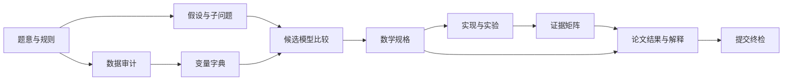

# 团队协作与交付物编排

将竞赛建模视为一条依赖链，而不是“建模、编程、写作”三条独立流水线。任何成员都可以承担多个角色，但每个交付物必须有负责人、审阅者、输入和通过条件。

## 1. 五类角色

| 角色 | 核心职责 | 主要交付物 | 不应单独决定的事项 |
|---|---|---|---|
| 问题架构 | 题意拆解、假设、子问题依赖 | 问题定义、假设表、任务图 | 未与数据核对的参数口径 |
| 数据与实验 | 数据审计、EDA、实验配置 | 数据字典、清洗记录、实验表 | 未经模型负责人确认的变量含义 |
| 模型与算法 | 候选比较、公式、求解策略 | 模型规格、算法说明、复杂度/可行性 | 未经验证的业务结论 |
| 验证与审计 | 基线、敏感性、复现、反例 | 证据矩阵、审计报告、修复建议 | 代替作者掩盖不确定性 |
| 叙事与交付 | 论文结构、图表、格式、提交 | 论文、附录、终检清单 | 改写会改变技术含义的公式/结论 |

当团队人数不足时，可合并角色，但**验证与审计应由未主导该模块的人复核**。这能减少自证循环。

## 2. 交付物依赖图



不要跳过节点。尤其禁止从“题意”直接跳到“代码”或从“图表”直接跳到“结论”。

## 3. 推荐节奏

### 起步阶段

先用不超过总时间的 15% 产出题意拆解、数据审计和候选模型比较。此阶段的目标不是写完整论文，而是排除错误问题定义。

### 中段迭代

用约 55% 的时间完成主模型、基线、实验和验证。每轮迭代只推进一个假设、一个模型规格或一个实现变更；更新 `decision_log` 和证据矩阵。

### 收束与交付

用剩余约 30% 的时间完成稳健性、叙事、格式和独立复核。至少预留一次“从题面重新阅读”的逆向审计，检查论文是否真正回答所有问题。

时间比例应按题目复杂度调整；若数据获取/清洗是主要瓶颈，应增加起步阶段时间，不要压缩审计。

## 4. 每次同步必须回答的八个问题

1. 现在试图回答哪个子问题？
2. 该子问题的输入、输出和验收标准是什么？
3. 当前最小可行模型是什么？
4. 关键假设是否被数据或题设支持？
5. 最新结果是否通过最基本的量纲、边界和可行性检查？
6. 哪个结论仍然只是猜测？
7. 下一步最有信息价值的实验或审计是什么？
8. 哪些文字、图表、代码或参数会因本次更改而失效？

## 5. 论文证据链

每个主章节按以下顺序组织，避免“先给炫目的结果、后补方法”。

1. **目的：** 该子问题为何需要解决。
2. **输入与假设：** 使用哪些题设、数据和简化。
3. **模型：** 变量、公式、约束和参数。
4. **求解：** 算法、实现、求解状态和配置。
5. **证据：** 表图、实验、基线或推导。
6. **解释：** 结果实际意味着什么，不能意味着什么。
7. **局限：** 该证据失效的条件。

## 6. 图表审阅协议

每张关键图或表都要通过以下检查：

| 检查 | 要求 |
|---|---|
| 识别 | 编号、标题、数据/实验来源、生成时间或配置 |
| 语义 | 轴、单位、颜色、筛选条件、样本范围清晰 |
| 一致 | 与正文数值、模型版本和表格一致 |
| 解释 | 紧邻正文有一句明确说明它支持何种结论 |
| 风险 | 不截断误导坐标；不隐藏不确定性或失败情景 |

## 7. 终检责任矩阵

| 检查项 | 初检人 | 复核人 | 通过标准 |
|---|---|---|---|
| 题意完整覆盖 | 问题架构 | 叙事与交付 | 每个任务均有章节和结论 |
| 公式与代码一致 | 模型与算法 | 验证与审计 | 可定位的一一映射 |
| 数据与结果可复现 | 数据与实验 | 验证与审计 | 新环境可重跑关键结果 |
| 结论证据充分 | 叙事与交付 | 问题架构 | 证据矩阵无空缺 |
| 格式与提交规则 | 叙事与交付 | 任意独立成员 | 满足当届规则 |
```
