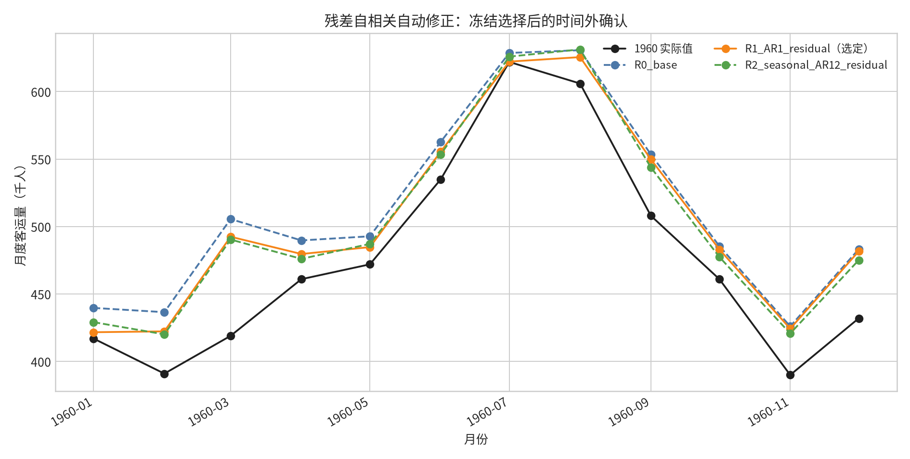

# 残差自相关自动修正：技能更新与测试报告

## 结论

`competition-mathematical-modeling-workflow` 已将时间序列的残差自相关从“仅记录风险”升级为**自动诊断、有限候选修正、内部滚动验证选择、冻结后单次时间外确认和明确回退**的受控流程。技能包校验通过。

> 自动化不会默认采纳更复杂模型。若修正未在训练期内部验证中同时改善主指标并降低同类残差问题，工作流必须回退到原模型，或升级为数据/规格/问题级修复。

## 1. 更新内容

| 文件 | 更新 | 实际作用 |
|---|---|---|
| `SKILL.md` | 在预测验证阶段加入残差自相关触发后的必经流程。 | 强制先审计时间对齐、泄漏与断点，再在训练期内部选择修正候选。 |
| `references/verification-and-repair.md` | 新增“残差自相关自动修正与回退”协议。 | 定义 R0–R3 候选、滞后上限、滚动验证、`Δ_min`、冻结外部测试与升级路径。 |
| `templates/model-evidence-pack.md` | 新增“残差自相关自动修正”记录表。 | 保存触发、前置审计、候选、内部选择、最终确认和回退理由。 |

## 2. 自动修正规则

自动流程仅用于已完成数据审计且具有严格时间顺序的预测任务。它先在训练残差上按预先声明的滞后集合执行 ACF 与适当的白噪声诊断；触发后，只在固定候选库中比较 R0（无修正）、R1（低阶 AR 残差）、R2（季节残差）与 R3（动态重规格）。默认非季节滞后上限为 `min(5, floor(n_train/10))`；季节候选必须有至少三个完整周期的历史支撑。

候选必须在最终测试期以外的滚动原点验证中满足预先固定的主指标与最小实用改善阈值。若题目未指定，默认 `Δ_min=2%`。最终测试只在候选冻结后运行一次，**绝不允许因为最终测试上其他候选数值更好而重新选择模型**。

## 3. 既有 AirPassengers 案例测试

测试使用公开 AirPassengers 月度数据：1949-01 至 1959-12 为外部训练窗，1960 年为最终测试期；内部选择原点固定为 1957-12 与 1958-12。[1] [2]

### 3.1 触发与内部选择

| 项目 | R0：无修正 | R1：AR(1) 残差 | R2：季节 AR(12) 残差 |
|---|---:|---:|---:|
| 最终训练残差 ACF(1) | 0.786（触发阈值 0.171） | — | — |
| 内部平均 MAE | 39.268 | **29.501** | 37.054 |
| 相对 R0 改善 | 0.000% | **24.873%** | 5.639% |
| 内部平均绝对残差 ACF(1) | 0.479 | **0.186** | 0.477 |
| 是否通过内部门禁 | 基线 | 是 | 是 |
| 冻结选择 | 否 | **是** | 否 |

R1 在固定的内部滚动验证窗上具有最低 MAE，且明显降低残差相关，因此在查看 1960 年最终测试前被选定。R2 也达到最小改善阈值，但内部表现较差，未被选定。

### 3.2 冻结后的单次时间外确认

| 候选 | MAE | RMSE | MAPE | 测试残差 ACF(1) | 选择状态 |
|---|---:|---:|---:|---:|---|
| R0：无修正 | 35.048 | 40.150 | 7.839% | 0.259 | 未选定。 |
| R1：AR(1) 残差 | **27.419** | **33.657** | **6.152%** | 0.145 | 冻结后确认。 |
| R2：季节 AR(12) 残差 | 26.392 | 31.494 | 5.885% | 0.091 | 未选定；最终测试结果不用于重选。 |

这项测试证明修正流程的关键不是“外部误差最低就选谁”，而是避免对最终测试期调参。尽管 R2 在 1960 年数值上更好，工作流仍保持 R1，因为 R1 是唯一由内部验证选择后再被外部确认的候选。

## 4. 安全边界与局限

本次实现采用 ACF 阈值作为轻量级触发诊断，不能替代完整的模型充分性研究。R1/R2 也只是有限修正候选；如果数据错位、结构断点、遗漏季节性或目标定义错误，残差建模不得替代相应的数据或规格修复。该测试只有两个内部原点和一个最终 12 月测试窗，因此它验证的是工作流的选择纪律和审计能力，而非任何模型的生产可靠性。

## 5. 复现与工件

`run_residual_autocorrection_test.py` 二次运行后，核心 JSON 与 CSV 结果逐字节一致。完整工件包括：自动修正规则设计、测试脚本、内部选择表、外部指标表、预测图、更新后的模型证据包和工作流技能包。

## References

[1] [AirPassengers 原始 CSV](https://raw.githubusercontent.com/jbrownlee/Datasets/master/airline-passengers.csv)

[2] [jbrownlee/Datasets 中的 AirPassengers 文件](https://github.com/jbrownlee/Datasets/blob/master/airline-passengers.csv)
