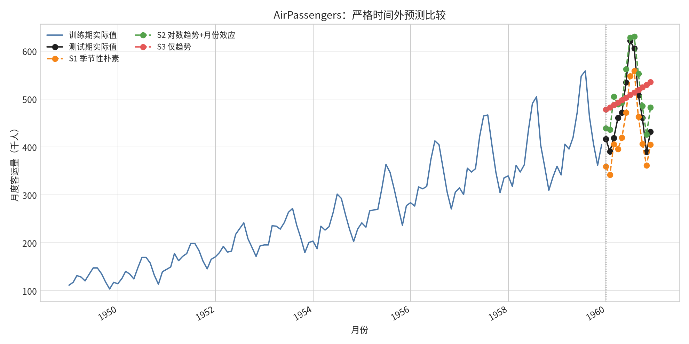
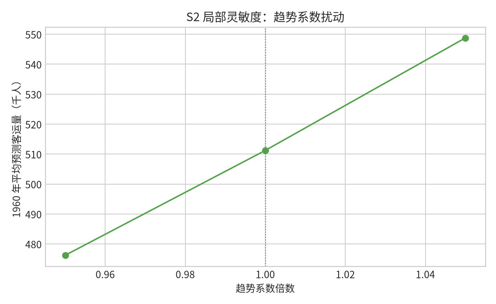

# `competition-mathematical-modeling-workflow` 实际效果测试报告

## 结论

更新后的技能在真实、可追溯的月度时间序列案例中完成了从数据审计到模型选择、复现、验证、灵敏度分析和审计交付的完整链条，最终判定为 **`pass-with-notes`**。测试的关键价值不在于把一个简单模型包装成“最佳模型”，而在于工作流能够保留弱点：它拒绝了遗漏季节结构的候选作为主模型，并将残差相关和单一时间外窗口明确升级为后续修复事项。

> **实际效果：** 新增的候选准入门禁、灵敏度设置表与 AI/外部实现复核栏都被实际填写和使用；它们没有沦为静态说明。

## 1. 测试设计

| 项目 | 设置 |
|---|---|
| 真实数据 | 公开 AirPassengers 月度客运量，1949-01 至 1960-12，共 144 条。[1] [2] |
| 训练/测试 | 1949-01 至 1959-12 训练（132 条）；1960 年严格时间外测试（12 条）。 |
| 基线 S1 | 季节性朴素：上一年同月值。 |
| 主候选 S2 | `log(客运量)` 的线性时间趋势与月份固定效应 OLS。 |
| 被拒绝候选 S3 | 仅趋势回归；因缺少季节结构而不能通过主模型准入。 |
| 实现与可复现性 | 本地 `numpy.linalg.lstsq`；数据 SHA-256 已固定；关键 JSON/CSV 二次运行逐字节一致。 |

## 2. 时间外结果

| 模型 | MAE | RMSE | MAPE | 偏差 | 工作流判定 |
|---|---:|---:|---:|---:|---|
| S1：季节性朴素基线 | 47.833 | 50.708 | 9.988% | -47.833 | 保留为基线。 |
| S2：对数趋势 + 月份效应 | **35.048** | **40.150** | **7.839%** | 35.048 | 主模型候选；优于基线，但仅 `pass-with-notes`。 |
| S3：仅趋势 | 69.716 | 79.367 | 15.213% | 30.239 | 结构不充分，只作为反例。 |

S2 在固定的 1960 年测试窗口中优于 S1，但测试不会把这一步误读为“模型已经可靠”。S2 的训练残差一阶相关为 **0.824**，显示仍可能遗漏动态依赖；同时仅有一个 12 月测试窗。因此，技能要求把结果写为有限的时间外改善，而不是可泛化或生产级预测结论。

## 3. 新增技能要求的实际验证

| 新增或强化要求 | 测试中的实际表现 | 结论 |
|---|---|---|
| 候选准入门禁 | 对目标、数据、假设与复现性逐项记录；S3 因未处理季节性而不能成为主模型。 | 有效地阻止“由算法名称倒推问题”。 |
| 候选比较与题意—公式映射 | S1/S2 比较，变量、月份效应、正值边界及预测对象均回链到公式和代码。 | 选型与规格可审计。 |
| 外部/AI 实现复核 | 明确记录：未采用 AI 生成模型或第三方预测实现；本地 OLS 代码、基线与反例构成有限独立检查。 | 证据来源边界明确。 |
| 灵敏度设置与结论边界 | 对趋势系数做 -5%、0%、+5% OAT；明确它只反映局部敏感性。 | 避免把局部排序夸大为全局重要性。 |
| 四层审计与问题升级 | 残差相关、单一测试窗和未做偏差校正均进入审计表及最小修复集。 | 流程能暴露问题，而非掩盖问题。 |
| 复现要求 | 单一脚本重复运行后，核心 JSON/CSV 文件逐字节一致。 | 可复现性要求可执行。 |

## 4. 灵敏度测试

以 S2 的已拟合趋势系数为基准，在固定其他系数条件下进行局部一因子一变（OAT）扰动。输出为 1960 年平均预测客运量。

| 趋势系数倍数 | 平均预测（千人） | 相对基准变化 |
|---:|---:|---:|
| 0.95 | 476.222 | -6.845% |
| 1.00 | 511.215 | 0.000% |
| 1.05 | 548.781 | 7.348% |

该结果只说明**基准附近的趋势系数**会如何改变该案例的平均点预测，不涉及月份效应、参数交互、结构不确定性或长期外推。因此，工作流的灵敏度字段实现了“记录并限界”的效果，而非提供虚假的完整稳健性证明。

## 5. 审计结论与下一步

审计结论为 **`pass-with-notes`**。若升级为实际预测研究，最小修复集是：增加滚动原点验证，补充正式残差诊断，比较动态误差或状态空间模型，并以更完整的参数与结构不确定性设计替代当前的单参数局部 OAT。上述问题属于模型和验证层，不能通过润色报告或重复运行脚本解决。

## 6. 可复现工件

完整证据链包括测试题设、模型证据包、审计报告、固定数据快照、运行脚本、结构化结果、CSV、PNG 与视觉核验记录。关键文件如下。

| 工件 | 作用 |
|---|---|
| `airpassengers_model_evidence_pack.md` | 实际填充的候选准入、规格、实验、验证和主张—证据模板。 |
| `airpassengers_audit.md` | 四层审计、高/中低风险问题、最小修复集与最终判定。 |
| `run_workflow_test.py` | 单一可复现计算脚本。 |
| `results/workflow_test_results.json` | 数据审计、参数、时间外指标、边界与灵敏度协议。 |
| `results/forecast_comparison.csv` / `.png` | 三个候选的时间外预测对比。 |
| `results/trend_oat_sensitivity.csv` / `.png` | 局部 OAT 的数值与图表。 |

## References

[1] [AirPassengers 原始 CSV](https://raw.githubusercontent.com/jbrownlee/Datasets/master/airline-passengers.csv)

[2] [jbrownlee/Datasets 中的 AirPassengers 文件](https://github.com/jbrownlee/Datasets/blob/master/airline-passengers.csv)
